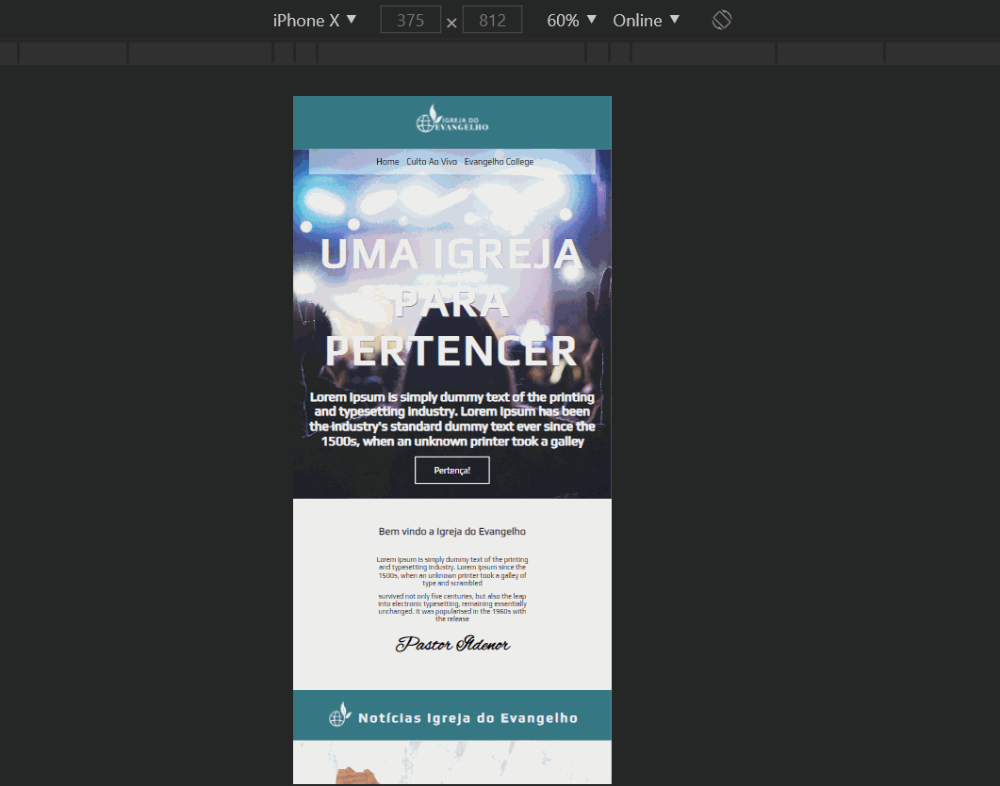

# Site Igreja do Evangelho

### - Este site fez parte de um desafio do curso progamadorBR FullStack que estou fazendo para me especializar em programação WEB. Após terminar os módulos de HTML básico, HTML intermediário, CSS básico e CSS Intermediário, foi lançado o desafio de fazer a primeira venda de um site como freelancer, desta forma, pude colocar todos os conhecimentos adquiridos nos módulos concluídos. 

### - Nesta aplicação foram usados as seguintes tecnologias:

#### *HTML.
#### *CSS.

### Front End para desktop

### Front End para celular

### Acesse o site e veja você mesmo! Link: https://relaxed-nobel-10b31d.netlify.app/

### Gostou do meu projeto? :D Entre em contato comigo! 
[Linkedin](https://www.linkedin.com/in/lucas-rosa-058683102/)  
[Email: lucasmetron@gmail.com](mailto:lucasmetron@gmail.com)

